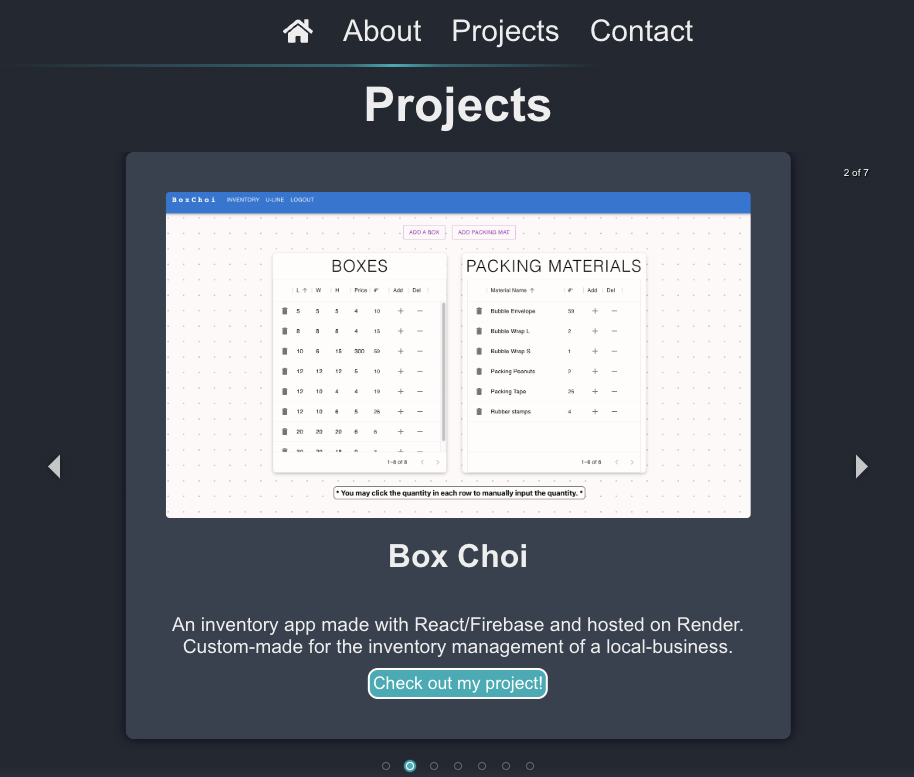

<div id="top"></div>
[![Contributors][contributors-shield]][contributors-url]

[![MIT License][license-shield]][license-url]

[![React][react-shield]][react-url]

<div>
<h2 align="center">Andrew Choi's Portfolio</h2>
<p align="center">
    A Portfolio made with React and deployed to Render
    <br />
    <a href="https://github.com/WhaleAnchor/AC-React-Portfolio"><strong> Go to the GitHub Repository »</strong></a>
    <br />
    <br />
    <a href="https://github.com/WhaleAnchor/AC-React-Portfolio">Deployed on Render</a>
    ·
    <a href="https://github.com/WhaleAnchor/AC-React-Portfolio/issues">Report Bug</a>
    ·
    <a href="https://github.com/WhaleAnchor/AC-React-Portfolio/issues">Request Feature</a>
  </p>
</div>

## Table of Contents

<li><a href="#about-me">About Me</a></li>
<li><a href="#work-experience">Work Experience</a></li>
<li><a href="#certifications">Certifications</a></li>
<li><a href="#skills-&-interests">Skills & Interests</a></li>
<li><a href="#getting-started">Getting Started</a></li>
<li><a href="#license">License</a></li>
<li><a href="#contact">Contact</a></li>

This is the source code for my personal portfolio website. It showcases my work as a Full Stack Web Developer and my background in other fields.
The website is deployed using Render.[Andrew Choi's Portfolio](https://andrew-chois-portfolio.onrender.com/).
 
 
## About Me

My name is Andrew Choi, and I am a Full Stack Web Developer, Language Interpreter, Translator, Events Director, Media Team Lead, and Music Instructor.

<p align="right">(<a href="#top">back to top</a>)</p>

### Education

- Cypress College | Cypress, CA: Aug. 2012 – May 2016 (Psychology and Sociology)
- Biola University | La Mirada, CA: Aug. 2018 – March 2020 (Bachelors of Arts, Sociology | Bible Minor - Incomplete)
- UCI Coding Bootcamp | Irvine, CA: Jun. 2022 – Dec 2022 (Full-Stack Web Development)

<p align="right">(<a href="#top">back to top</a>)</p>

### Work Experience

- Freelance | Fullerton, CA: Oct. 2011 – Present (Web Development | Language Interpreter and Translator)
- International Mailbox | Fullerton, CA: Feb. 2012 – Present (Manager | Notary Public | Live Scan Fingerprint Operator)
- Evergreen Hills Presbyterian Church | Gardena, CA: Apr. 2015 – Present (Events Director | Media Team Lead | Music Instructor)

<p align="right">(<a href="#top">back to top</a>)</p>

### Certifications

- UCI Coding Bootcamp Certificate (June 2022 - Dec. 2022) – Full stack Web Development 6-month Bootcamp at UCI
- California Notary Public – Legal notarization services for various documents
- Certifix Live Scan Operator – Conducted DOJ and FBI background checks for live scan applicants

<p align="right">(<a href="#top">back to top</a>)</p>

### Skills & Interests

- Technical Skills: HTML, CSS, SQL, NoSQL, JavaScript, MongoDB, Express, React, Node, Adobe Photoshop, Adobe Premiere Pro, Ableton Live
- Interests: Climbing, playing musical instruments, traveling, making art for fun or for assets in game development hobby

<p align="right">(<a href="#top">back to top</a>)</p>

## Getting Started

To run the project locally, follow these steps:

1. Clone the repo.
    ```sh
    git clone git@github.com:WhaleAnchor/AC-React-Portfolio.git
    ```
2. Download the dependencies.
   ```sh
    npm i
   ```
3. Run the development server.
    ```sh
    npm run start
    ```

The website should now be running at [http://localhost:3000](http://localhost:3000).

<p align="right">(<a href="#top">back to top</a>)</p>

## Deployment

The website is deployed using Render. To deploy your own version, follow the [Render deployment guide](https://render.com/docs/deploy-create-react-app).

<p align="right">(<a href="#top">back to top</a>)</p>

## License

This project is licensed under the MIT License.

<p align="right">(<a href="#top">back to top</a>)</p>

## Acknowledgments

- Thank you to all the instructors and mentors at UCI Coding Bootcamp for providing an excellent learning experience.
- Special thanks to friends, family, and colleagues who have supported and inspired me throughout my journey.

<p align="right">(<a href="#top">back to top</a>)</p>
<!-- Markdown links -->
[contributors-shield]:https://img.shields.io/github/contributors/WhaleAnchor/AC-React-Portfolio.svg?style=for-the-badge
[contributors-url]:https://github.com/WhaleAnchor/AC-React-Portfolio/graphs/contributors

[license-shield]:https://img.shields.io/github/license/othneildrew/Best-README-Template.svg?style=for-the-badge
[license-url]:https://github.com/othneildrew/Best-README-Template/blob/master/LICENSE.txt

[react-shield]:https://img.shields.io/badge/React-20232A?style=for-the-badge&logo=react&logoColor=61DAFB
[react-url]:https://react.dev/reference/react
